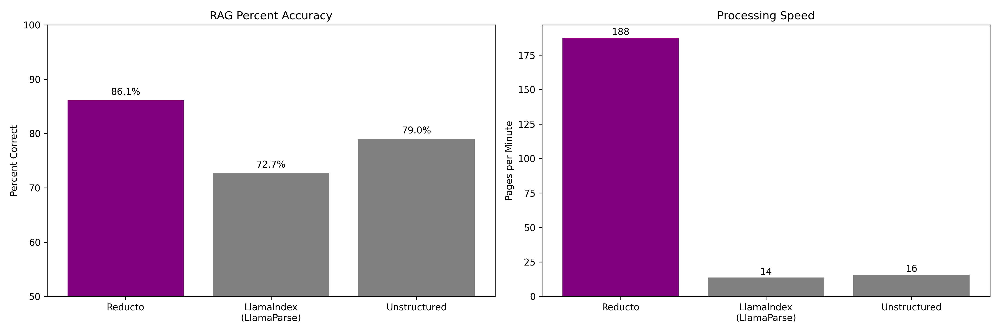

# Introducing Reducto's Document API
We've spent the last few months building what we believe is the most powerful document ingestion for LLM workflows. We're excited to share more about what we've built below, but you can [try our demo here](https://app.reducto.ai/share/030cb778-466b-46c9-a6d9-8863bed9abe0).

### High quality RAG is hard. High quality document processing shouldn't be.
Reducto started when we were consulting for teams building with LLMs. We went into our projects expecting to help teams with fun ML problems, but very quickly learned that one of the biggest bottlenecks across most pipelines was actually well before retrieval or generation.

Simply put, processing PDFs accurately is really hard.

Almost everything on the market worked when we were given simple layouts with perfect file metadata, but those same solutions consistently were slow and inaccurate when we tried using them with complex documents. Multi column layouts get jumbled together, figures are ignored, and tables are a consistent nightmare. Our peers told us that they had to spend dozens of hours building in house processing pipelines because off the shelf solutions weren't enough.

Our goal since then has been to build something so accurate that people like us to see ingestion as a solved problem.

### Our vision focused approach
PDFs are designed for humans to understand visually, so we decided to take a similar approach with our processing.

Our process starts with a layout segmenting model to understand where everything is and what it is. By classifying every text block, table, image, and figure, we're able to use a very specific approach for each and then recompose the document structure in a way that captures the original content. There's a lot that goes into each pipeline, but in short we:
- Accurately extract text and tables even with nonstandard layouts
- Automatically convert graphs to tabular data and summarize images in documents
- Intelligently chunk information using the document’s layout data
- Process long documents in seconds

We've tested this approach with really challenging examples and found that it's able to perform in cases where traditional document processing fails (like the table below!). You can test our API outputs with your own docs here.

### Gold in = Gold out
Bad ingestion leads to low response quality and hallucinations, but we also really think that high quality parsing can meaningfully improve the overall performance of RAG pipelines. We put that to the test by benchmarking overall RAG performance using Reducto's parsing and a few other solutions in the space.

This benchmark uses a scanned 10-K filing and 823 question/answer pairs created by LlamaIndex to evaluate RAG. We initially graded each response using GPT-4, and then followed up with a manual review of each question/answer pair to verify correctness. We also tracked latency when processing the document. In order to make the comparison fair we kept all parts of the RAG pipeline identical across each ingestion method.

You can view our evaluation code and outputs [here](/benchmarks/benchmark.py).

### Work With Us
We've been fortunate to be able to build Reducto alongside the most supportive customers we could ask for, and are ready to onboard more. If you're building with LLMs and would like to improve your document ingestion pipeline, please reach out to us at founders@reducto.ai.